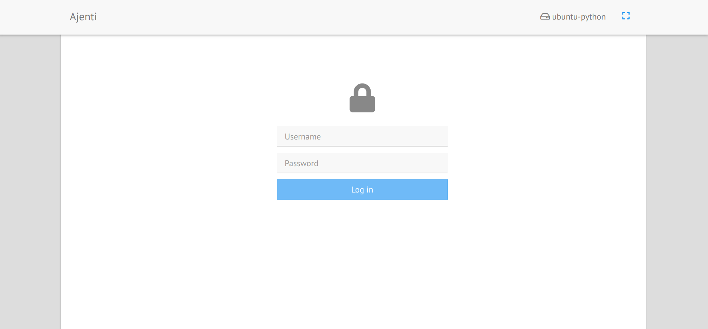
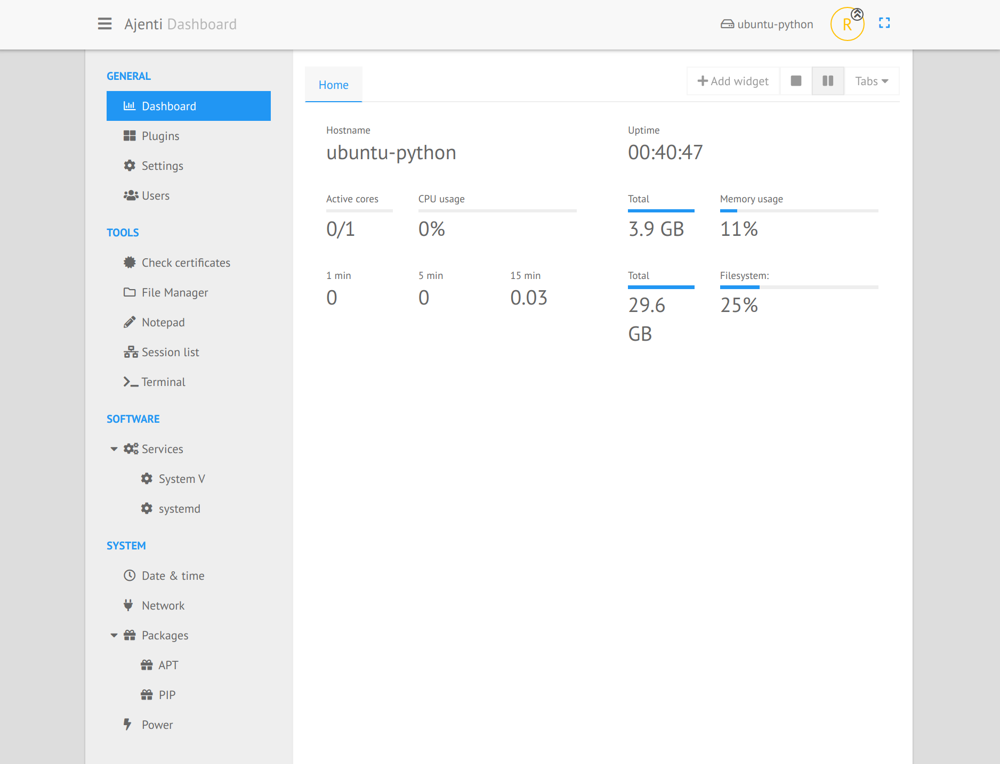
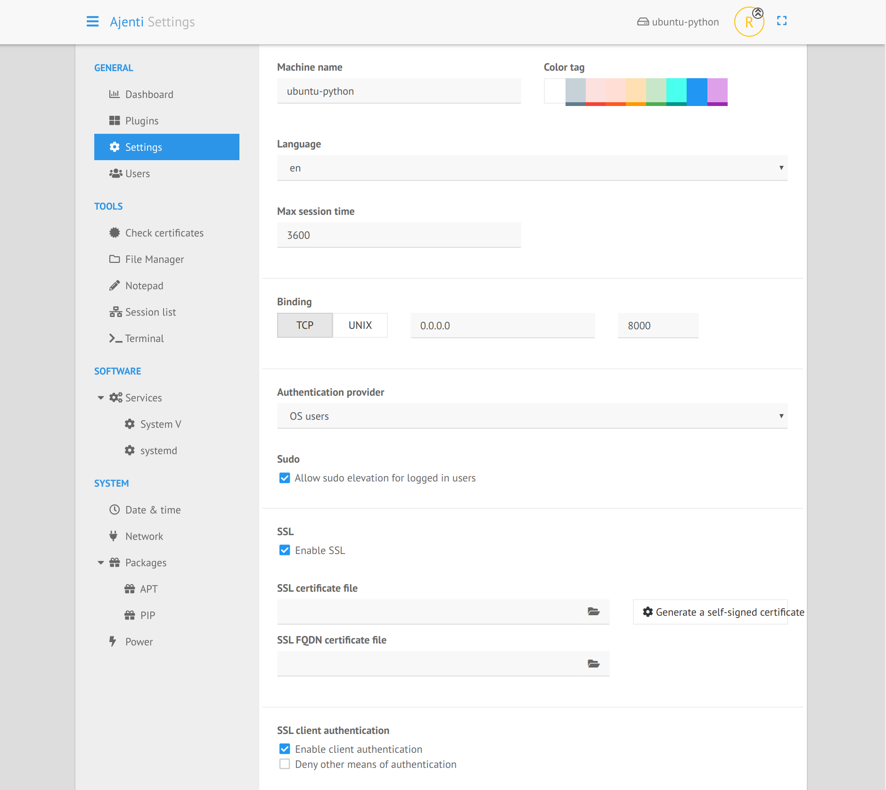
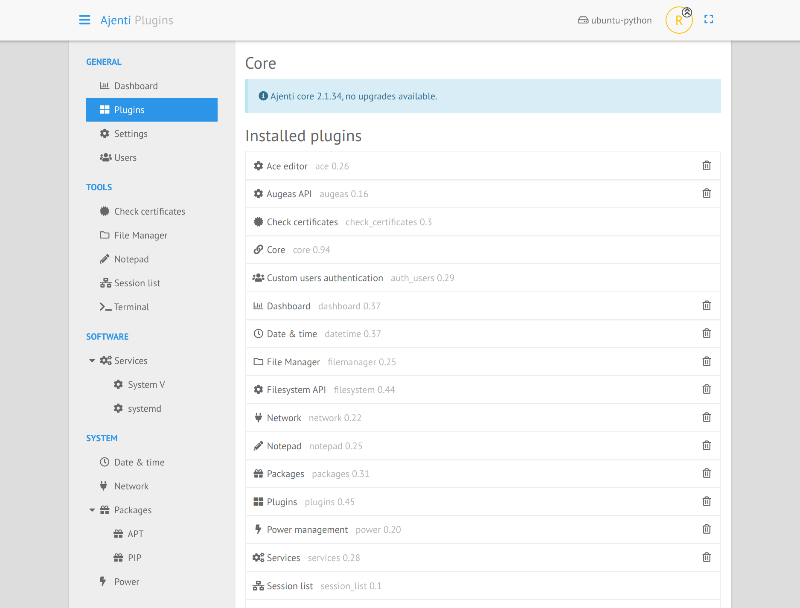
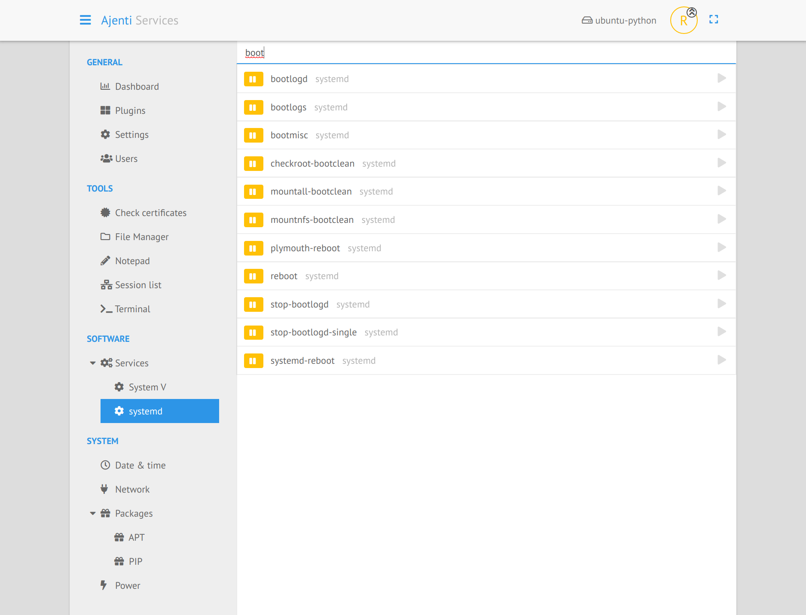
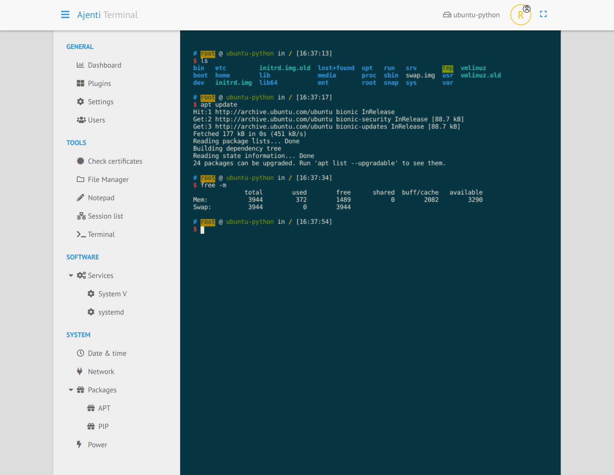

Ajenti is a Linux & BSD modular server admin panel. Ajenti 2 provides a new interface and a better architecture, developed with [Python3](https://www.python.org/) and [AngularJS](https://angularjs.org/).

    
    
    

----

# Feature highlights

* **Easy installation** : Ajenti 2 can be easy installed [with pip and the provided script](https://docs.ajenti.org/en/latest/man/install.html#installing).

* **Existing configuration** : Picks up your current configuration and works on your existing system as-is, without any preparation.

* **Caring** : Does not overwrite your config files, options and comments. All changes are non-destructive.

* **Batteries included** : Includes lots of plugins for system and software configuration, monitoring and management.

* **Extensible** : Ajenti 2 is easily extensible using Python. Plugin development is a quick and pleasant with Ajenti APIs. [Write your first plugin](https://docs.ajenti.org/en/latest/dev/intro.html#your-first-plugin).

* **Modern** : Pleasant to look at, satisfying to click and accessible anywhere from tablets and mobile.

* **Lightweight** : Small memory footprint and CPU usage. Runs on low-end machines, wall plugs, routers and so on.

----

# Screenshots

<table align="center">
    <tr>
        <td align="center">
            
        </td>
        <td align="center">
            
        </td>
        <td align="center">
            
        </td>
    </tr>
    <tr>
        <td align="center">
            
        </td>
        <td align="center">
             
        </td>
        <td align="center">
            
        </td>
    </tr>
</table>

See https://ajenti.org for more information

----

# Contributors ✨

Thanks goes to these wonderful people ([emoji key](https://allcontributors.org/docs/en/emoji-key)):

<!-- ALL-CONTRIBUTORS-LIST:START - Do not remove or modify this section -->
<!-- prettier-ignore-start -->
<!-- markdownlint-disable -->
<!-- markdownlint-enable -->
<!-- prettier-ignore-end -->
<!-- ALL-CONTRIBUTORS-LIST:END -->

This project follows the [all-contributors](https://github.com/all-contributors/all-contributors) specification. Contributions of any kind welcome!