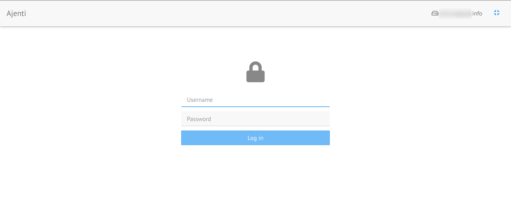
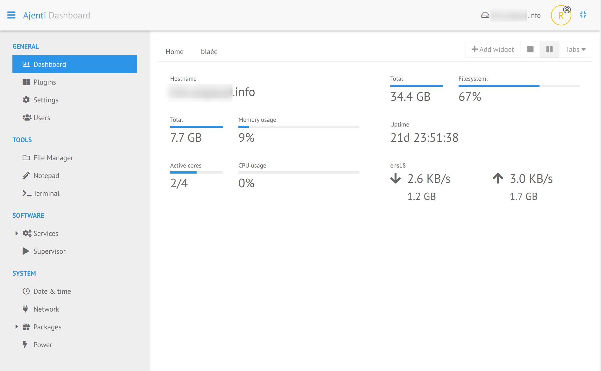
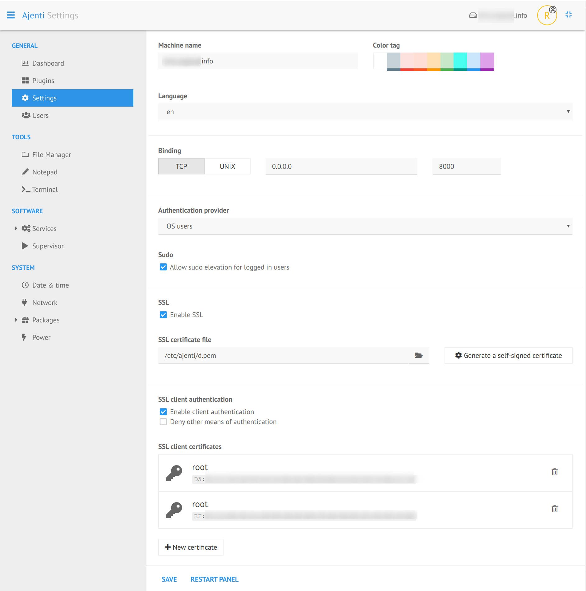
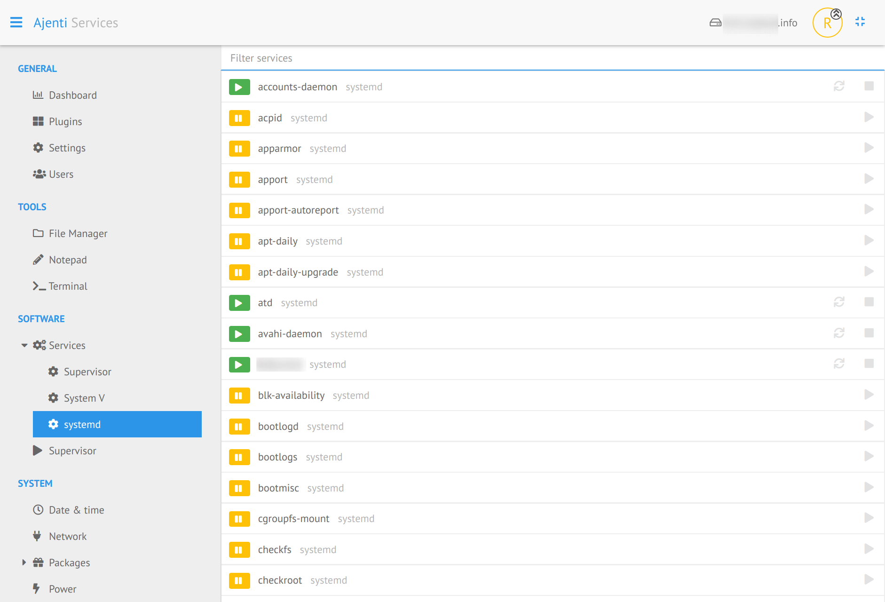

Ajenti 2
========

http://ajenti.org/

Ajenti is a Linux & BSD web admin panel. Ajenti 2 provides a new interface and a better architecture.

Feature highlights
==================

Easy installation
-----------------

Ajenti 2 can be easy installed [with pip and the provided script](http://docs.ajenti.org/en/latest/man/install.html#installing).

Existing configuration
----------------------

Picks up your current configuration and works on your existing system as-is, without any preparation.

Caring
------

Does not overwrite your config files, options and comments. All changes are non-destructive.

Batteries included
------------------

Includes lots of plugins for system and software configuration, monitoring and management.

Extensible
----------

Ajenti 2 is easily extensible using Python. Plugin development is a quick and pleasant with Ajenti APIs. [Write your first plugin](http://docs.ajenti.org/en/latest/dev/intro.html#your-first-plugin).

Modern
------

Pleasant to look at, satisfying to click and accessible anywhere from tablets and mobile.

Lightweight
-----------

Small memory footprint and CPU usage. Runs on low-end machines, wall plugs, routers and so on.

See http://ajenti.org for more information
