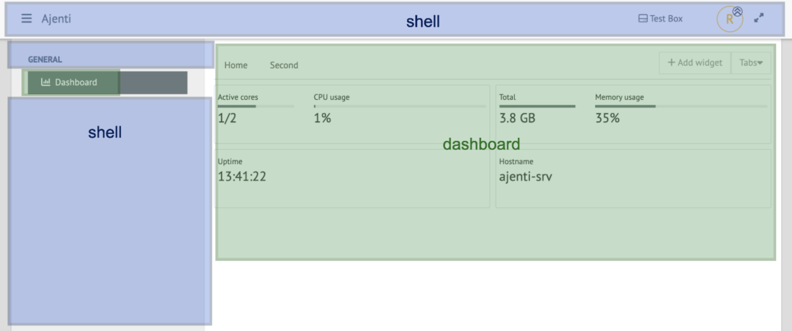

.. _architecture:

Architecture and how it works
*****************************

Backend
=======
Ajenti project itself consists of **Ajenti Core** and a set of stock plugins forming the **Ajenti Panel**.

Ajenti Core
-----------

Represents the core backend and it's the entry point of Ajenti.

* HTTP server
* IoC container
* Base classes and Interfaces
* Simplistic web framework
* Set of core components aiding in client-server communications

Ajenti Panel
------------

* Startup script
* Plugins developed for the Ajenti Core (``filemanager``, ``terminal``, ``notepad``, etc.)

Modus operandi
--------------
During bootstrap, Ajenti Core will locate and load Python modules containing Ajenti plugins (identified by a ``plugin.yml`` file). It will then register the implementation classes found in them in the root IoC container. Some interfaces to be implemented include :class:`aj.api.http.HttpPlugin`, :class:`aj.plugins.core.api.sidebar.SidebarItemProvider`.

Ajenti Core runs a HTTP server on a specified port, managing a pool of isolated session workers and forwarding requests to these workers, delivering them to the relevant :class:`aj.api.http.HttpPlugin` instances. It also supports Socket.IO connections, forwarding them to the relevant :class:`aj.api.http.SocketEndpoint` instances.

Ajenti contains a mechanism for session authentication through PAM login and ``sudo`` elevation. Standard ``core`` plugin provides HTTP API for that.

Authenticated sessions are moved to isolated worker processes running under the corresponding account. 

Frontend
========

The frontend can be divided into two main parts:
 - core part (plugin ``shell`` and ``ngx-ajenti``)
 - extension plugins (``ace``, ``dashboard``, ``filemanager``,.. )

Screenshot

shell (plugin)
--------------
Serves as a container for other plugins. Plugins are implemented as micro-frontends and are loaded within the shell.
It uses `@angular-architects/module-federation <https://www.npmjs.com/package/@angular-architects/module-federation>`_ package of Angular Architects.
For deep dive into Webpack 5’s module federation usage with Angular see the
`link <https://www.angulararchitects.io/en/aktuelles/the-microfrontend-revolution-module-federation-in-webpack-5/>`_.

* Basic navigation (Header, Siderbar, Routing,.. )
* Container for other plugins
* Config management

ngx-ajenti (plugin)
-------------------
Represents the shared library.

* Authentication and Identity management
* Global (TS) services and components
* Navigation (Header, Siderbar, Routing,.. )
* Config management
* Plugin manager
