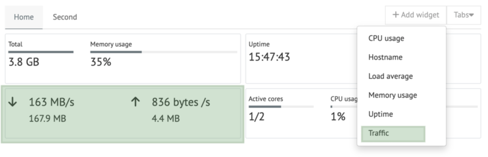

Dashboard Widgets
*****************

The dashboard (plugin) provides a way how to extend dashboard with some extra widgets.
This is done by implementing a new module containing the new widget(s).

Example of a Traffic widget (located in the ``traffic`` module)

Example implementation
======================
Elements to be implemented
    * Backend: Widget class
    * Backend: Widget config endpoint (Optional)
    * Frontend: WidgetComponent
    * Frontend: Widget config component (Optional)

Backend: Widget class
---------------------
This class must implement the ``aj.plugins.dashboard.widget``. It's used for the registration in the backend and as a provider for the widget data.
Dashboard will issue periodic requests to your :class:`aj.plugins.dashboard.api.Widget` implementations.
If user creates multiple widgets of same type, a single instance will be created to service their requests.

Example widget class::

    @component(Widget)
    class TrafficWidget(Widget):
        id = 'traffic'
        name = _('Traffic')

        ..

        def get_value(self, config):
           ...

           return { .. }

Backend: Widget config endpoint (Optional)
------------------------------------------
This is required only if the widget is configurable.
The endpoint is implemented as a handler from the ``HttpPlugin``
The decorator ``@url`` will register the endpoint in the backend.::
    @component(HttpPlugin)
    class Handler(HttpPlugin):
        ..

        @url(r'/api/traffic/interfaces')
        @endpoint(api=True)
        def handle_api_interfaces(self, http_context):
            ..
            return ..

Frontend: WidgetComponent
-------------------------

This is the actual UI shown to the user. It's implemented as a Angular component.
This component must be exposed in the ``webpack.config.js`` as part of the ModuleFederationPlugin.

Widget component implementation: https://github.com/ajenti/demo-plugins/tree/master/demo_5_widget/frontend/components/demowidget/

Webpack registration: https://github.com/ajenti/demo-plugins/tree/master/demo_5_widget//frontend/webpack.config.js#L35
