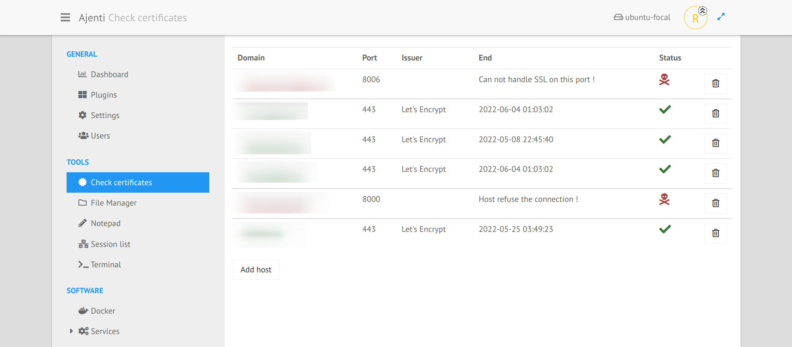
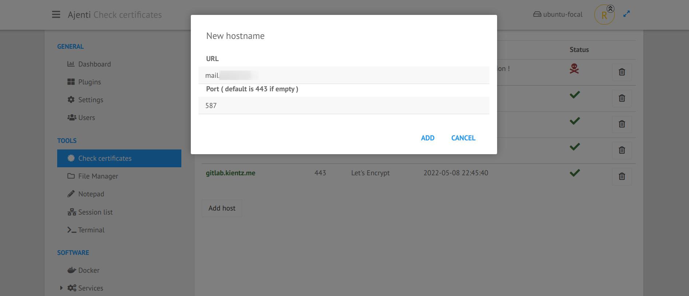

.. _plugin_check_certificates:

Plugin check_certificates
*************************

You can see with one look if your SSL certificates are still valid or not.

The list view let you see the hostname,the port, the issuer of the certificate, the end of the certificate, and the status of the connection.

It's pretty easy to add or to remove an hostname. By default, a test will be done on port 443, the standart one for ``HTTPS``.
But you can naturally specify something else, like 8000 or 587.

If the port 587 is specified, ``Ajenti`` will try to open a ``STARTTLS`` connection, e.g. for email server.

