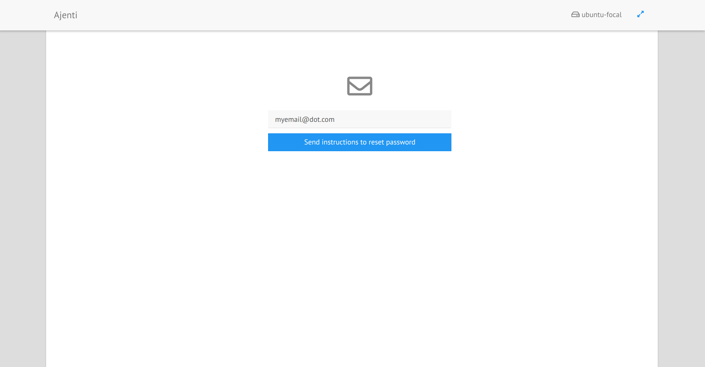

.. _plugin_core:

Plugin core
***********

The main plugin of ``Ajenti`` is the core plugin.

.. image:: ../../img/rd-login.png

This plugin manages:

 * the authentication process,
 * user environment setup,
 * session management,
 * the way the resources are delivered (CSS, JS, etc ... ),
 * the main template and the main style of ``Ajenti``,
 * the entries in the sidebar,
 * error handling,
 * password reset,
 * configurations (``Ajenti``, user config).

It delivers a lot of tools, services, components for the other plugins too:

 * hotkeys,
 * tasks,
 * pushs,
 * dialogs,
 * progress spinner,
 * navbox,
 * messagebox,
 * smartprogerss,
 * customization,
 * translations with gettext,
 * notifications,
 * socketio.

