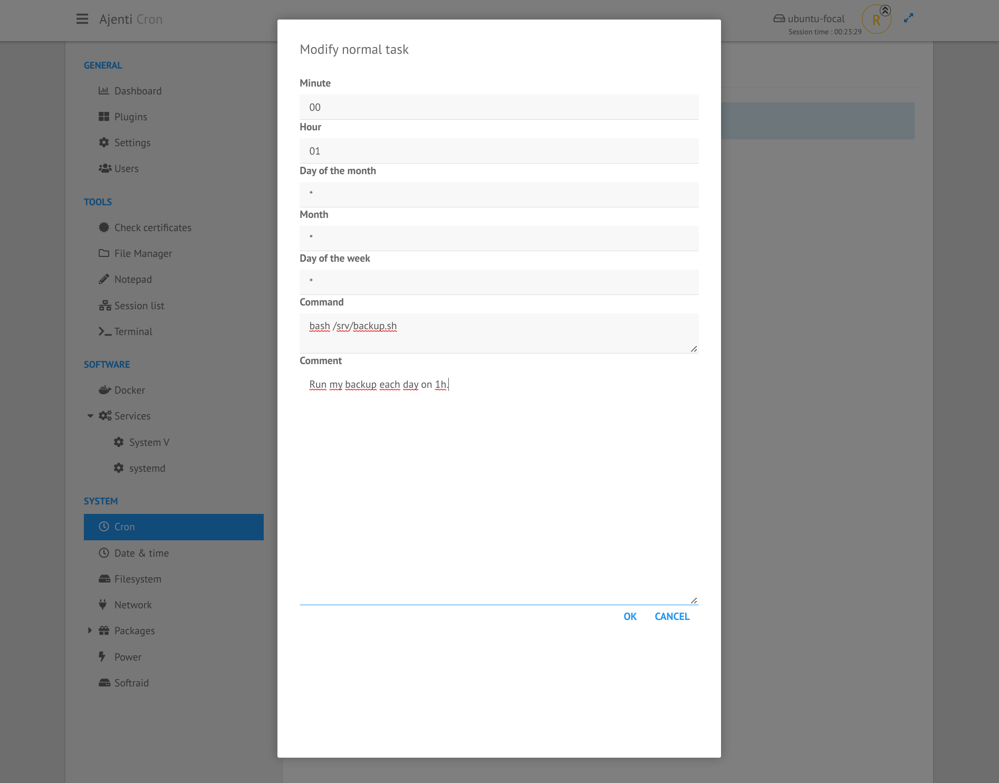

.. _plugin_cron:

Plugin cron
***********

This plugin allows to handle all entries in a personal ``cron`` file.

.. image:: ../../img/rd-cron-list.png

This is quite equivalent as running ``crontab -l -u USER`` to manage your own cronjobs.

With this plugin, you can:

 * add jobs,
 * remove jobs,
 * edit jobs,
 * edit special entries ( @yearly, etc ... ),
 * set environment variables,
 * add comments.

