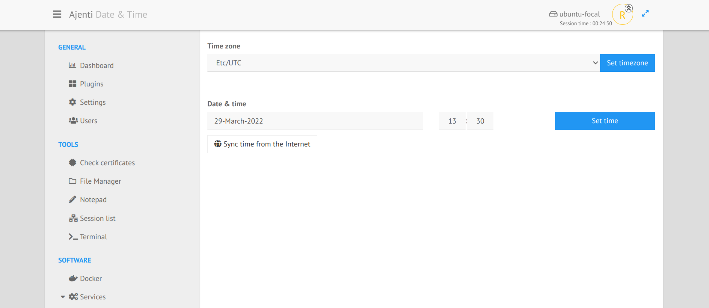

.. _plugin_datetime:

Plugin datetime
***************

This plugin displays the current time zone used, and time and date set on the server.

It's possible to:

 * change the time zone used,
 * set the time on the server,
 * synchronize time using ``NTP`` (package ``ntpdate`` is for this necessary).