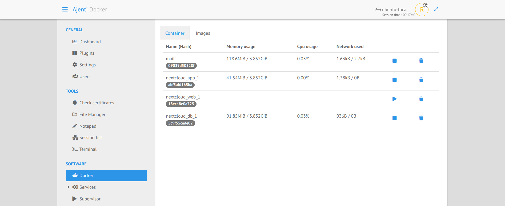
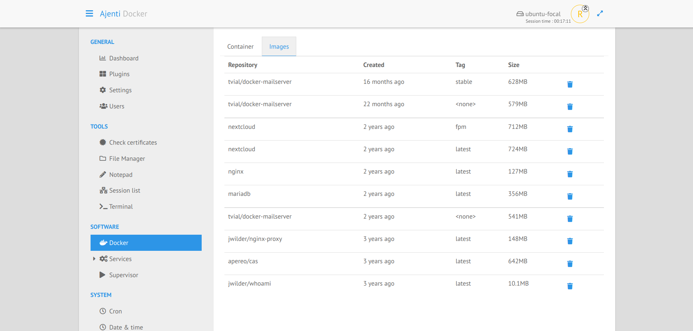

.. _plugin_docker:

Plugin docker
*************

This plugin allows to show all running containers and images from a locally docker instance.

The default tab shows all containers, with their names and id, and you can:

 * start/stop a container,
 * remove a container,
 * see memory usage, cpu usage and network I/O

On the second tab, you will see the stored images with their sizes.

You can easily choose which one you want to delete.

