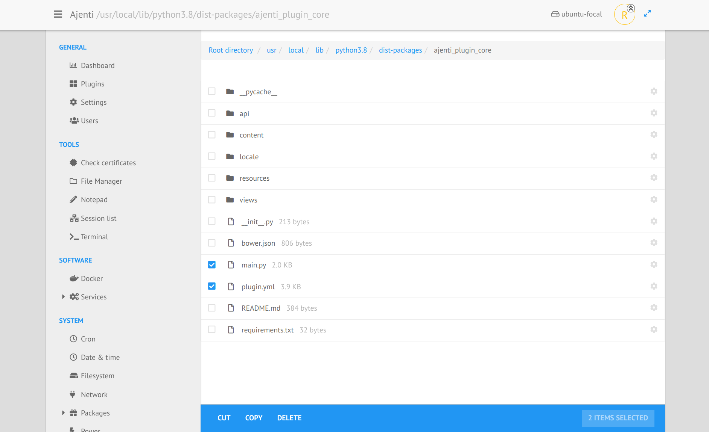
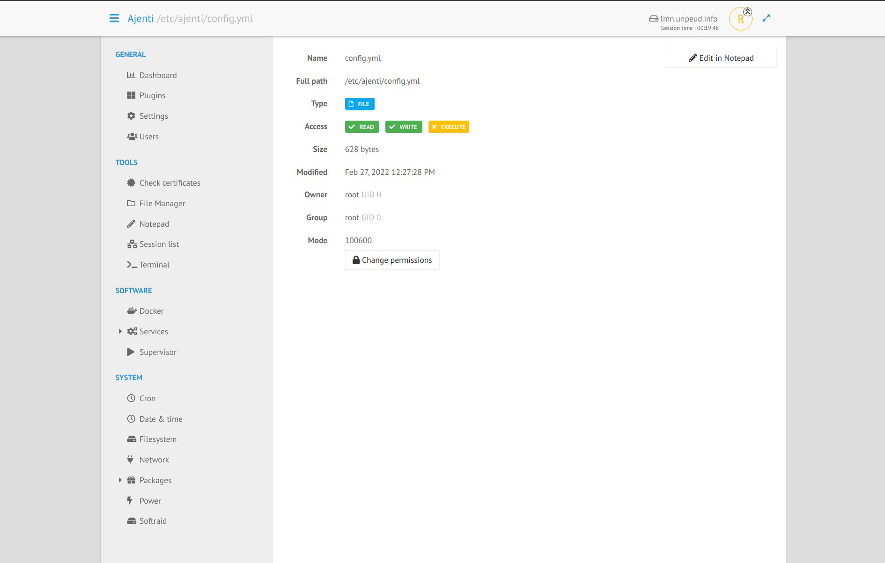

.. _plugin_filemanager:

Plugin filemanager
******************

This plugin let you navigate on the server filesystem and perform all common operations on files and directories.

Currently, it's possible to:

 * create new files, new directories,
 * upload a file through drag&drop,
 * navigate in many tabs,
 * cut, copy, delete files and directories (you must first select at least one object),
 * display the properties of an object,
 * easily navigate between directory with the breadcrumb.

In the properties view you will see all common informations (permissions, last change date, owner, etc ... the same as the command ``stat``).

If the file is plain text, a button ``Edit in Notepad`` will appear and let you modify the file.

You can also change the permissions of the file:

.. image:: ../../img/rd-filemanager-permissions.png