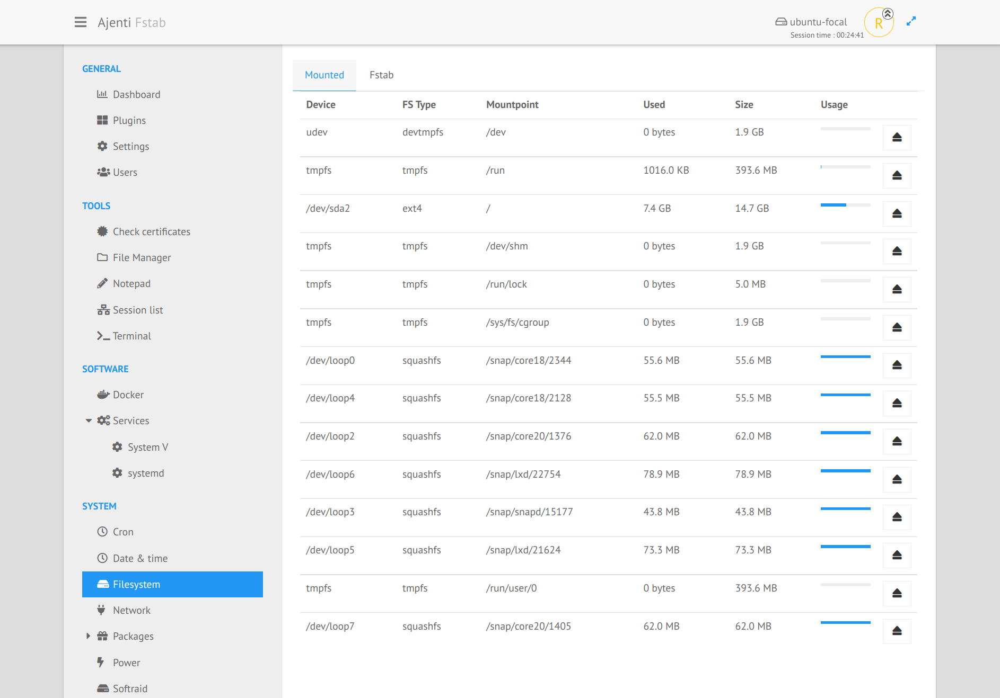
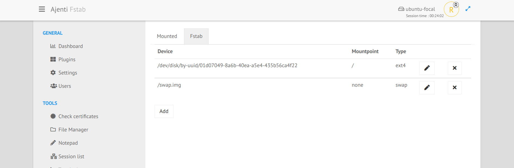

.. _plugin_fstab:

Plugin fstab
************

The first tab shows the output of the ``mount`` command with some util informations like:

 * filesystem type,
 * mountpoint,
 * used space,
 * total size.

The button on the right let you unmount the desired device, but you should use it with caution (don't try to unmount the root fs!).

The second tab lists all entries in ``/etc/fstab`` and let you add/modify or delete the entries.

But you should also be careful here with what you are doing.

