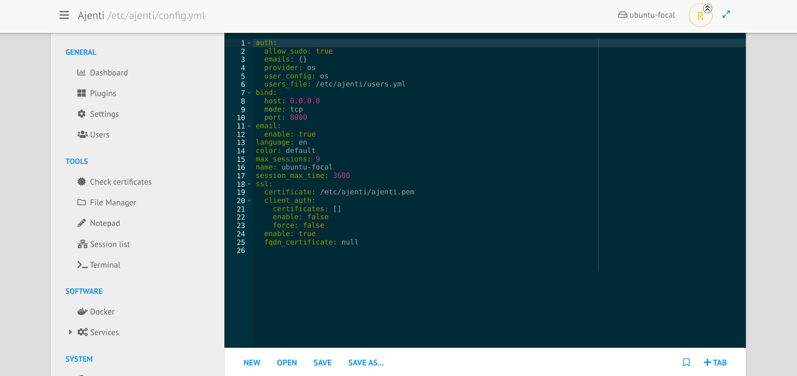

.. _plugin_notepad:

Plugin notepad
**************

Based on the `ACE editor <https://ace.c9.io>`_, you can:

 * edit all plain text files,
 * create a new file,
 * save an existing file in another location,
 * manage all of these files with tabs.

Hotkey:

 * Ctrl + O : open file
 * Ctrl + N : new file
 * Ctrl + S : save file

