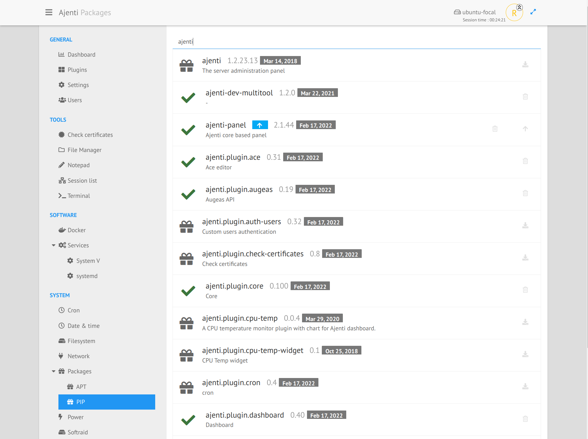

.. _plugin_packages:

Plugin packages
***************

In order to manage the packages installed on your server, the plugin ``packages`` provides a quick search to filter the packages matching the search query.

Actually, the supported package engines are ``APT`` and ``PIP``.

It's necessary to enter at least 3 chars in the search to automatically get a packages list, and then perform usual operations:

 * see if a package is installed,
 * see the version,
 * see if a newer version is available,
 * install/update a package,
 * remove a package.

