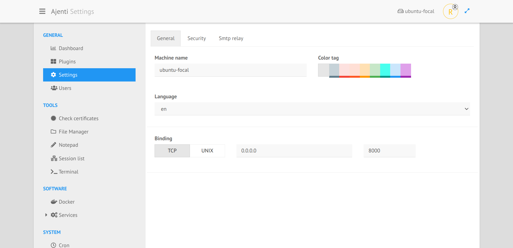
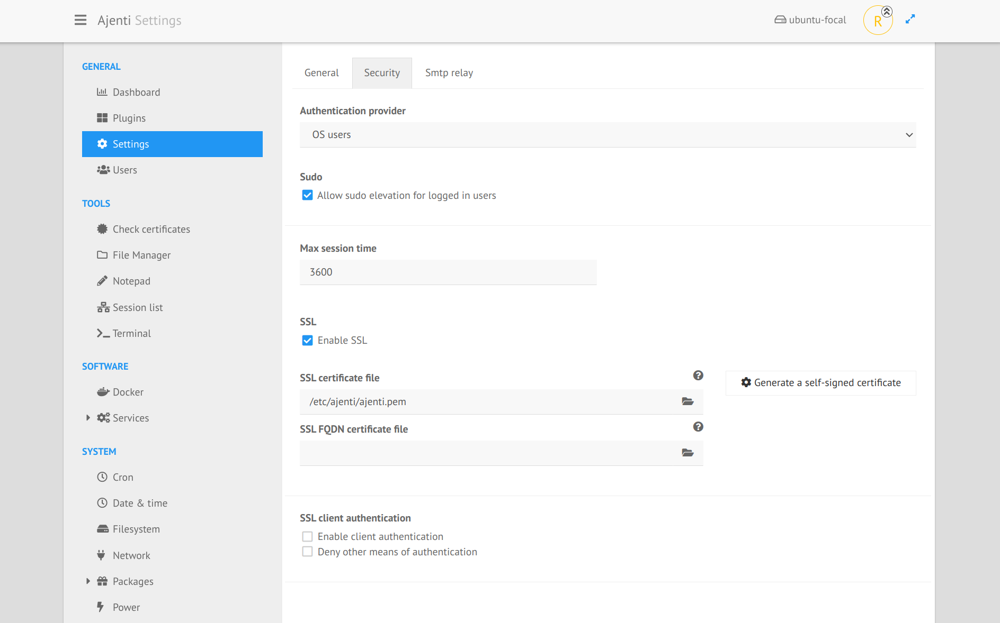
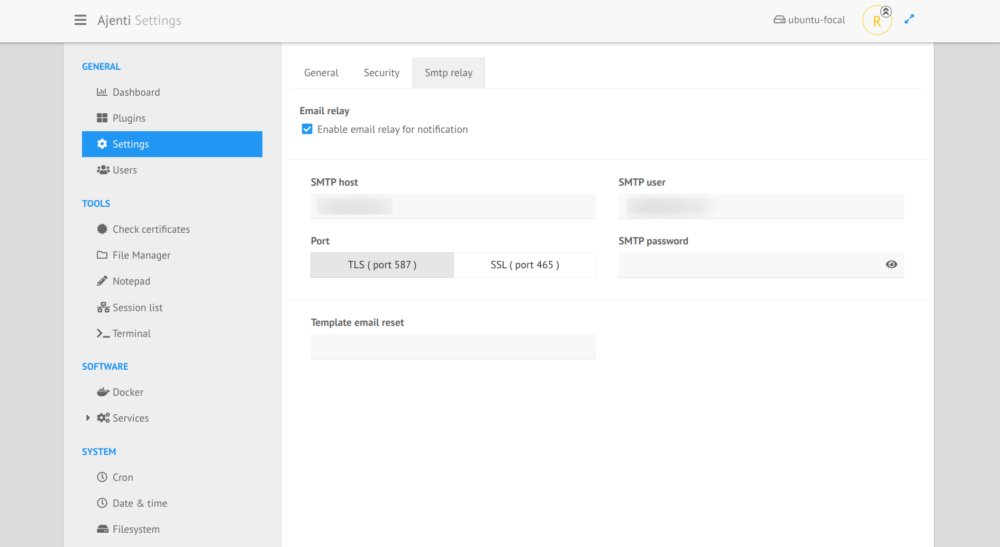

.. _plugin_settings:

Plugin settings
***************

This page gives access to the settings stored in ``/etc/ajenti/config.yml`` and ``/etc/ajenti/smtp.yml``.

For a full description of the configuration files, please see :ref:`Configuration files <configuring>`.

After changing the settings, it's necessary to restart the panel.

Tab General
===========

This tab contains the binding settings, language, hostname set in ``Ajenti`` et color style.

Tab Security
============

You can choose:

 * the authentication provider (OS or USERS),
 * allow sudo elevation or not,
 * set the timeout of a session,
 * configure SSL and certificates,
 * configure SSL and certificates for client authentication.

Tab Smtp relay
==============

This tab provides the credentials saved in ``/etc/ajenti/smtp.yml``.

