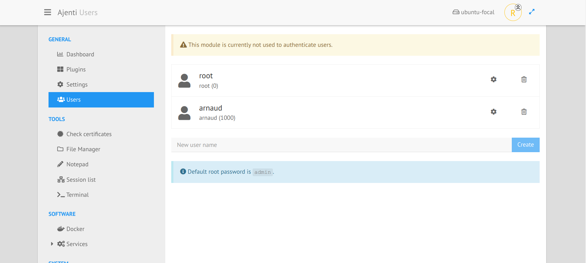
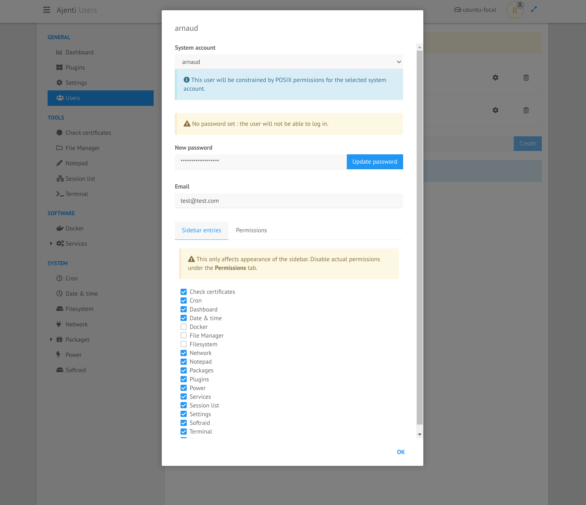

.. _plugin_users:

Plugin users
************

The default authentication provider used in ``Ajenti`` is the OS provider which allows all users of the system to log in.

The plugin ``auth_users`` provides an alternative way to authenticate users, and to create custom users. All users data are stored in plain text, in ``/etc/ajenti/users.yml`` (but this is configurable).

The default view presents a list of current users and let you:

 * add a new user,
 * manage the properties of an existing user,
 * delete an existing user.

The property modal window displays some utilities per account:

 * system account: all user accounts must be bound to a system account in order to set the privileges. An user bound to ``root`` wil have all privileges, but an user bound to a system user account like ``arnaud`` will only have the privileges of the system user ``arnaud``.
 * password change: only a hash is stored, not the password itself,
 * set the email: for password reset,
 * select the sidebar entries and permissions of the user.

Don't forget to SAVE the changes when updating an user.